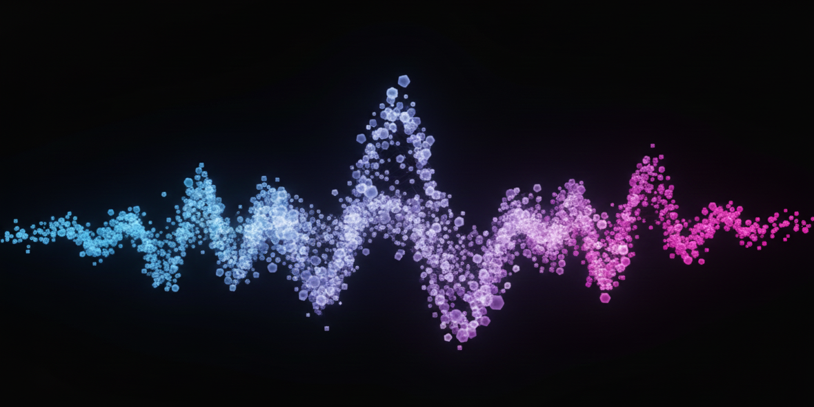
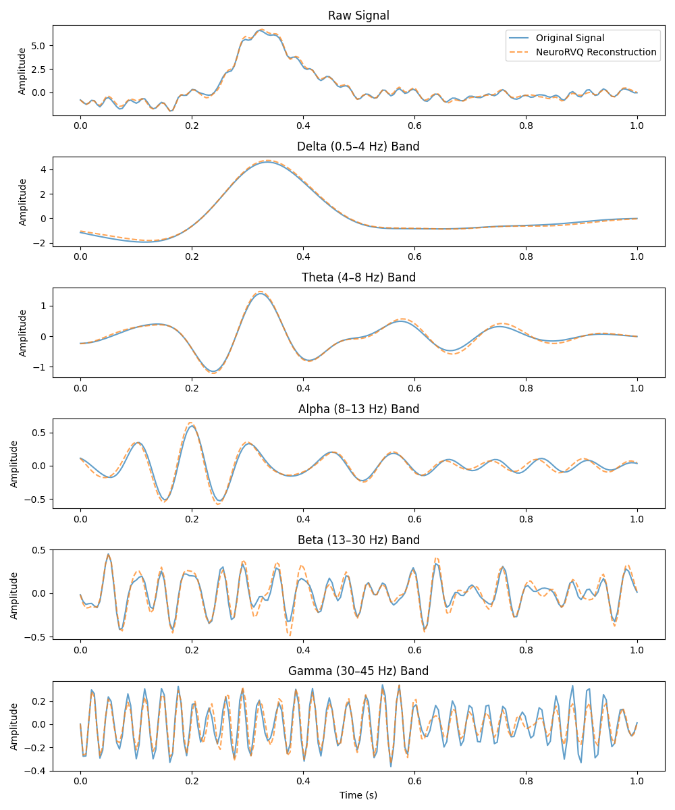
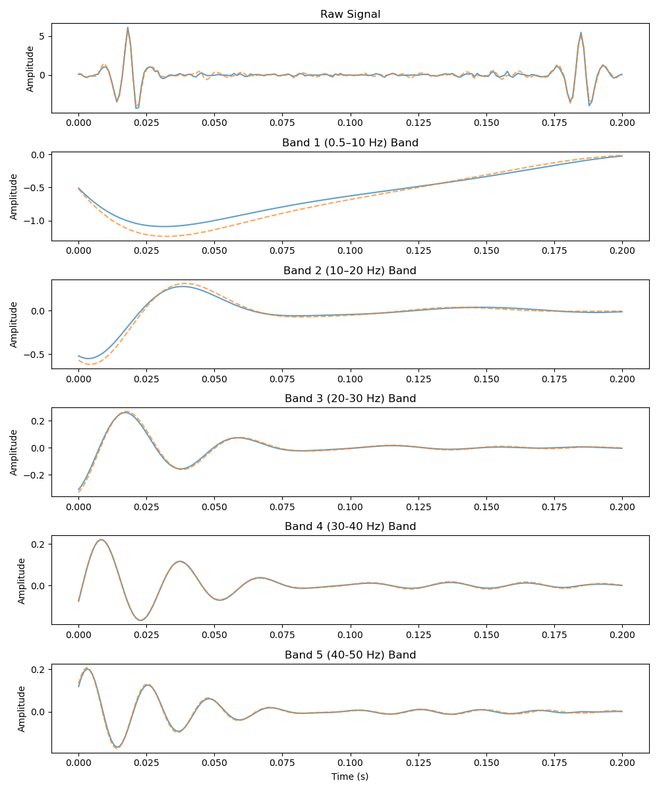
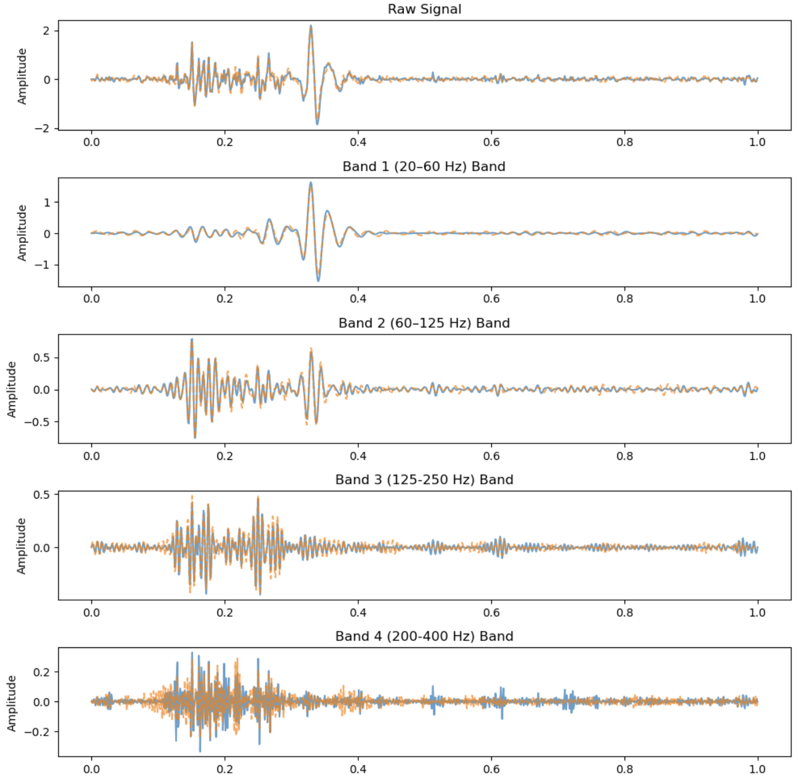

<div align="center">



# 🧠NeuroRVQ: Multi-Scale EEG Tokenization for Generative Large Brainwave Models

<a href='https://arxiv.org/abs/2510.13068'></a>

[Konstantinos Barmpas](https://www.barmpas.com)<sup>1,2</sup> &emsp; [Na Lee](https://www.linkedin.com/in/na-lee-57777387/)<sup>1,2</sup> &emsp; [Alexandros Koliousis](https://akoliousis.com)<sup>3</sup>   

[Yannis Panagakis](http://users.uoa.gr/~yannisp/)<sup>2,4,5</sup> &emsp; [Dimitrios Adamos](https://profiles.imperial.ac.uk/d.adamos)<sup>1,2</sup> &emsp; [Nikolaos Laskaris](https://people.auth.gr/laskaris/?lang=en)<sup>2,6</sup>  &emsp; [Stefanos Zafeiriou](https://profiles.imperial.ac.uk/s.zafeiriou)<sup>1,2</sup>  

<sup>1</sup>Imperial College London, United Kingdom <br>
<sup>2</sup>Cogitat, United Kingdom <br>
<sup>3</sup>Northeastern University London, United Kingdom <br>
<sup>4</sup>National and Kapodistrian University of Athens, Greece <br>
<sup>5</sup>Archimedes Research Unit, Greece <br>
<sup>6</sup>Aristotle University of Thessaloniki, Greece 

This is the official implementation of **NeuroRVQ**, a foundation model for biosignals powered by a state-of-the-art biosignal tokenizer

</div>

## 🌟 Overview

**NeuroRVQ Tokenizer** is a specialized network designed to convert raw biosignals into a sequence of compact and informative neural tokens. This transformation reduces the inherently high-dimensional and noisy nature of biosginals into a structured lower-dimensional representation that preserves essential temporal–spectral patterns. In doing so, the tokenizer provides a kind of "neural grammar" for neural activity. The input multi-variate timeseries is first segmented into patches. These patches are encoded by the multi-scale temporal encoder, that captures features in multiple resolutions and are then combined via the transfromer encoder. For each scale, RVQ codebooks discretize the embeddings into a sequence of neural tokens. Finally, these tokens are combined and passed through the tokenizer decoder to reconstruct the input patches using the Fourier spectrum.

**NeuroRVQ Foundation Model** is a scalable foundation model that operates on the tokenized representation. By working at the token level rather than raw signals, this model can better capture long-range dependencies, learn abstract neural dynamics and enable efficient pretraining across diverse EEG datasets. The model leverages the learned codebooks from the tokenizer stage and is trained using a masked-token prediction strategy, where a subset of input patches is randomly masked. This objective encourages the network to infer missing tokens from their surrounding context.

## Model and Modalities

| Modality | Support |
| :--- | :--- |
| **EEG** | ✅ |
| **EMG** | ✅ |
| **ECG** | ✅ |

| Model Version | Parameters | Modality | Model Path ('/pretrained_models/..') | 
| :--- | :--- | :--- | :--- |
| **NeuroRVQ-EEG-tokenizer-v1** | 76 Million | EEG | NeuroRVQ_EEG_tokenizer_v1.pt |
| **NeuroRVQ-EEG-foundation-model-v1** | 6 Million | EEG | NeuroRVQ_EEG_foundation_model_v1.pt |
| **NeuroRVQ-EMG-tokenizer-v1** | - | EMG | "To be released soon..." |
| **NeuroRVQ-EMG-foundation-model-v1** | - | EMG | "Training in Progress..." |
| **NeuroRVQ-ECG-tokenizer-v1** | - | ECG | "To be released soon..." |
| **NeuroRVQ-ECG-foundation-model-v1** | - | ECG | "Training in Progress..." |

## Tokenization / Reconstruction Capabilities

| EEG | ECG | EMG |
|:---:|:---:|:---:|
|  |  |  |

## Downstream Performance

### EEG

| Model      | Motor | ERP | Memory | Sleep* | Eyes | Mean | Size |
|-----------|-------|------|---------|---------|-------|--------|-------|
| NeuroGPT  | <u>0.682±0.083</u> | 0.757±0.048 | **0.597±0.029** | <u>0.674±0.033</u> | 0.827±0.036 | <u>0.707±0.046</u> | 79.5M |
| CBraMod   | 0.614±0.104 | 0.777±0.052 | <u>0.574±0.038</u> | 0.635±0.041 | <u>0.839±0.041</u> | 0.688±0.055 | 4.9M |
| BIOT      | 0.443±0.079 | 0.500±0.000 | 0.510±0.018 | -- | 0.763±0.049 | -- | 3.2M |
| MIRepNet  | 0.689±0.086 | -- | -- | -- | -- | -- | -- |
| LaBraM    | 0.630±0.076 | <u>0.822±0.040</u> | 0.526±0.026 | 0.652±0.037 | 0.799±0.047 | 0.686±0.045 | 5.8M |
| EEGPT     | 0.313±0.035 | 0.668±0.146 | 0.520±0.017 | 0.634±0.044 | 0.797±0.037 | 0.587±0.056 | 25.7M |
| **NeuroRVQ**  | **0.700±0.073** | **0.876±0.033** | <u>0.574±0.027</u> | **0.728±0.028** | **0.869±0.026** | **0.749±0.037** | 5.9M |

We used the benchmark presented in IEEE MLSP 2025 Paper [Assessing the Capabilities of Large Brainwave Foundation Models](https://ieeexplore.ieee.org/document/11204282).

#### About the Benchmark
Over the last decade, deep learning models have been widely used for automatic feature extraction and classification in various Brain-Computer Interface (BCI) tasks. However, their performance and generalization capabilities are often not adequately assessed, as these models are frequently trained and tested under flawed setups and / or influenced by spurious correlations. Recently, these limitations have also been observed in the training and evaluation of Large Brainwave Foundation Models (LBMs). In this work, we employ causal reasoning and careful consideration for task-discriminative artifacts in various EEG datasets covering diverse BCI paradigms and propose a benchmarking protocol to properly evaluate the decoding performance and generalization capabilities of LBMs. Utilising a subject-independent cross-validation approach for each curated benchmark dataset, we showcase that LBMs achieve marginal performance gains over conventional deep learning baselines.

[Open-Source Benchmark Code](https://github.com/dykestra/EEG-Benchmarking)

## Installation
```bash
conda create -n neurorvq python=3.10
conda activate neurorvq

# Install requirements
pip install -r requirements.txt
```

## Model Loading / Usage

Load tokenizer and see reconstruction results. Example for EEG tokenizer:
```python

from inference.run.NeuroRVQ_EEG_tokenizer_example import load_neurorqv_tokenizer

# Set run_example=True and plot_results=True to see reconstruction results
# Checkout the load_neurorqv_tokenizer() function to load and use tokenizer

load_neurorqv_tokenizer(run_example=True, plot_results=True, verbose=True,
                            model_path='./pretrained_models/tokenizers/NeuroRVQ_EEG_tokenizer_v1.pt')
```

Load foundation model and see an example for fine-tuning. Example for EEG foundation model:
```python

from inference.run.NeuroRVQ_EEG_FM_example import load_neurorqv_fm

# Checkout the load_neurorqv_fm() function with fine_tuning=False to see the correct model loading
# See the instructions in data.py for your custom dataset before setting fine_tuning=True

load_neurorqv_fm(fine_tuning=False, verbose=True,
                     model_path = './pretrained_models/foundation_models/NeuroRVQ_EEG_foundation_model_v1.pt')
```

## Citation
```
@misc{neurorvq,
      title={NeuroRVQ: Multi-Scale EEG Tokenization for Generative Large Brainwave Models}, 
      author={Konstantinos Barmpas and Na Lee and Alexandros Koliousis and Yannis Panagakis and Dimitrios A. Adamos and Nikolaos Laskaris and Stefanos Zafeiriou},
      year={2025},
      eprint={2510.13068},
      archivePrefix={arXiv},
      primaryClass={cs.LG},
      url={https://arxiv.org/abs/2510.13068}, 
}
```

