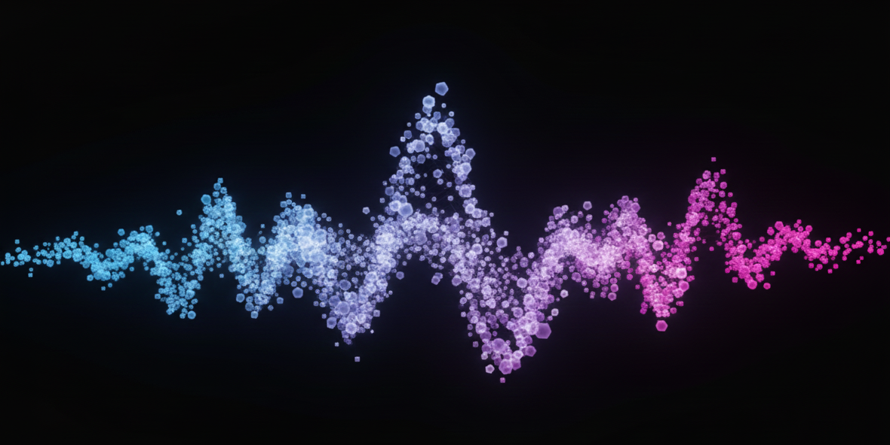
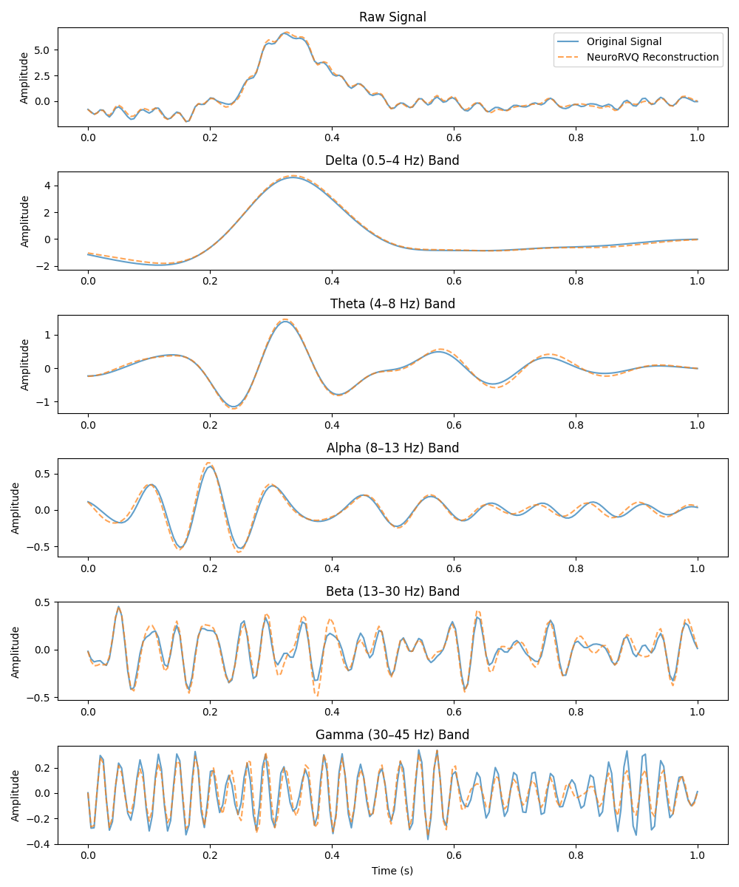
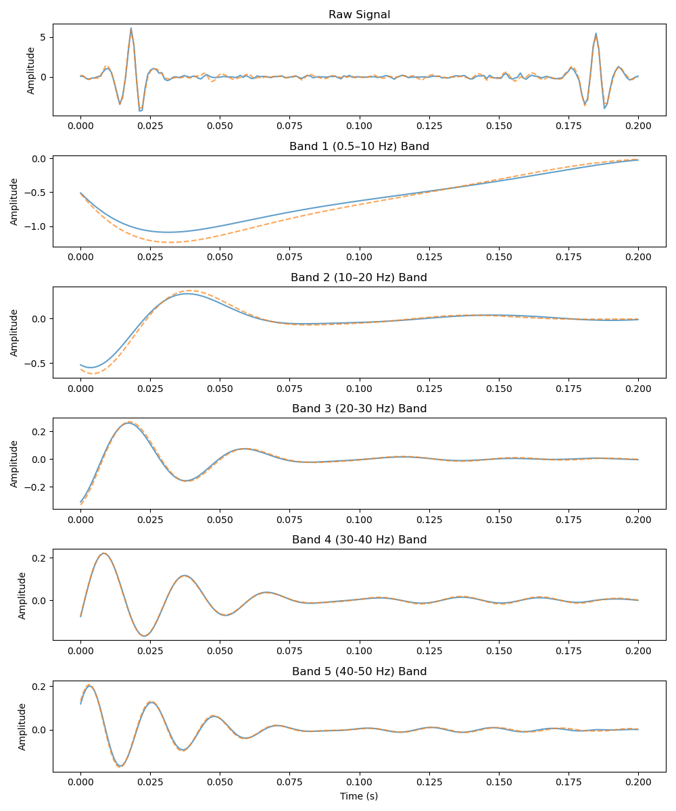
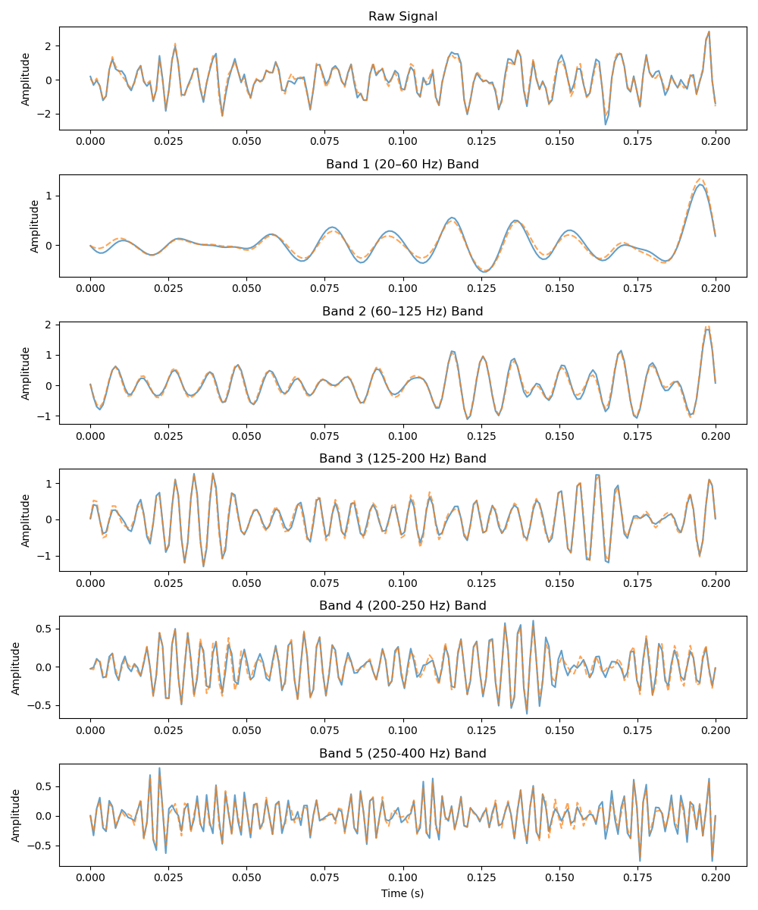

<div align="center">



# NeuroRVQ: Multi-Scale Biosignal Tokenization for Generative Foundation Models

<a href='https://arxiv.org/abs/2510.13068v4'></a>
<a href='https://huggingface.co/ntinosbarmpas/NeuroRVQ'></a>

[Konstantinos Barmpas](https://www.barmpas.com)<sup>1,2</sup> &emsp; [Na Lee](https://www.linkedin.com/in/na-lee-57777387/)<sup>1,2</sup> &emsp; [Dimitrios Chalatsis](http://dhalatsis.github.io)<sup>1</sup> &emsp; [William Raftery](https://www.linkedin.com/in/will-raf/)<sup>1</sup> &emsp;


[Yannis Panagakis](http://users.uoa.gr/~yannisp/)<sup>2,3,4</sup> &emsp; [Dimitrios Adamos](https://profiles.imperial.ac.uk/d.adamos)<sup>1,2</sup> &emsp; [Nikolaos Laskaris](https://people.auth.gr/laskaris/?lang=en)<sup>2,5</sup>  &emsp; 

[Alexandros Koliousis](https://akoliousis.com)<sup>6</sup> &emsp; [Dario Farina](https://profiles.imperial.ac.uk/d.farina)<sup>1</sup> &emsp;
[Stefanos Zafeiriou](https://profiles.imperial.ac.uk/s.zafeiriou)<sup>1,2</sup>  

<sup>1</sup>Imperial College London, United Kingdom <br>
<sup>2</sup>Cogitat, United Kingdom <br>
<sup>3</sup>National and Kapodistrian University of Athens, Greece <br>
<sup>4</sup>Archimedes Research Unit, Greece <br>
<sup>5</sup>Aristotle University of Thessaloniki, Greece <br>
<sup>6</sup>Northeastern University London, United Kingdom 

This is the official implementation of **NeuroRVQ**, a foundation model for biosignals powered by a state-of-the-art biosignal tokenizer. 

Visit the official website for more information: https://neurorvq.github.io

</div>

## 🌟 Overview

Biosignals such as electroencephalography (EEG), electrocardiography (ECG), and electromyography (EMG) encode physiological activity across multiple temporal and spectral scales, yielding representations that are rich but challenging for machine learning. Foundation models trained to predict masked signal tokens have shown promise in learning generalizable biosignal representations, yet their performance depends on the tokenizer's ability to preserve high-frequency dynamics and reconstruct signals with high fidelity. We introduce NeuroRVQ, a modality-adaptive biosignal tokenizer family designed for high-fidelity signal reconstruction. To capture the full frequency spectrum, NeuroRVQ decomposes biosignals into frequency-specific representations via multi-scale temporal convolutions, each encoded into hierarchical RVQ codebooks to preserve high-frequency detail, combined with a novel phase-aware training loss that respects the circular topology of Fourier phase. By tuning the temporal resolution, number and size of temporal kernels and RVQ depth, this design adapts to the spectro-temporal characteristics of each biosignal modality. To validate that tokenizer quality drives downstream performance, we train a simple masked-token foundation model for each modality (NeuroRVQ-FM) using the corresponding NeuroRVQ tokenizer. The NeuroRVQ-FM family achieves competitive or superior downstream performance compared to existing modality-specific foundation models, demonstrating that high-fidelity tokenization is a critical factor for effective biosignal modeling.

**NeuroRVQ Tokenizer** converts raw biosignals into compact and informative neural tokens. The input multi-variate time series is segmented into patches, encoded by the multi-scale temporal encoder at multiple resolutions, combined via a transformer encoder, then discretized into neural tokens through per-scale RVQ codebooks. Tokens are decoded to reconstruct the input patches using the Fourier spectrum.

**NeuroRVQ Foundation Model**  operates on the tokenized representation, using masked-token prediction with symmetric masking. By working at the token level, it captures long-range dependencies, learns abstract neural dynamics, and enables efficient pre-training across diverse biosignal datasets. The learned codebooks serve as prediction targets during pre-training, and the resulting representations transfer effectively to a range of downstream BCI tasks.

## Model and Modalities

| Modality | Support |
| :--- | :--- |
| **EEG** | ✅ |
| **EMG** | ✅ |
| **ECG** | ✅ |

| Model Version | Parameters | Modality | Trained Models <a href='https://huggingface.co/ntinosbarmpas/NeuroRVQ'></a> | 
| :--- | :--- | :--- | :--- |
| **NeuroRVQ-EEG-tokenizer-v1** | 76 Million | EEG | NeuroRVQ_EEG_tokenizer_v1.pt |
| **NeuroRVQ-EEG-foundation-model-v1** | 6 Million | EEG | NeuroRVQ_EEG_foundation_model_v1.pt |
| **NeuroRVQ-EMG-tokenizer-v1** | 144 Million | EMG | NeuroRVQ_EMG_tokenizer_v1.pt |
| **NeuroRVQ-EMG-foundation-model-v1** | 6 Million | EMG | NeuroRVQ_EMG_foundation_model_v1.pt |
| **NeuroRVQ-ECG-tokenizer-v1** | 76 Million | ECG | NeuroRVQ_ECG_tokenizer_v1.pt |
| **NeuroRVQ-ECG-foundation-model-v1** | 6 Million | ECG | NeuroRVQ-ECG-foundation-model-v1 |

## Tokenization / Reconstruction Capabilities

| EEG | ECG | EMG |
|:---:|:---:|:---:|
|  |  |  |

## Downstream Performance

### EEG

| Model      | Motor | ERP | Memory | Sleep* | Eyes | Mean | Size |
|-----------|-------|------|---------|---------|-------|--------|-------|
| NeuroGPT  | <u>0.682±0.083</u> | 0.757±0.048 | **0.597±0.029** | <u>0.674±0.033</u> | 0.827±0.036 | <u>0.707±0.046</u> | 79.5M |
| CBraMod   | 0.614±0.104 | 0.777±0.052 | <u>0.574±0.038</u> | 0.635±0.041 | <u>0.839±0.041</u> | 0.688±0.055 | 4.9M |
| BIOT      | 0.443±0.079 | 0.500±0.000 | 0.510±0.018 | -- | 0.763±0.049 | -- | 3.2M |
| MIRepNet  | 0.689±0.086 | -- | -- | -- | -- | -- | -- |
| LaBraM    | 0.630±0.076 | <u>0.822±0.040</u> | 0.526±0.026 | 0.652±0.037 | 0.799±0.047 | 0.686±0.045 | 5.8M |
| EEGPT     | 0.313±0.035 | 0.668±0.146 | 0.520±0.017 | 0.634±0.044 | 0.797±0.037 | 0.587±0.056 | 25.7M |
| **NeuroRVQ**  | **0.700±0.073** | **0.876±0.033** | <u>0.574±0.027</u> | **0.728±0.028** | **0.869±0.026** | **0.749±0.037** | 5.9M |

We used the benchmark presented in IEEE MLSP 2025 Paper [Assessing the Capabilities of Large Brainwave Foundation Models](https://ieeexplore.ieee.org/document/11204282).

[Open-Source Benchmark Code Available](https://github.com/dykestra/EEG-Benchmarking)

### ECG

| Model | 5-class Accuracy | 5-class BAcc | 43-class Accuracy | 43-class BAcc |
|---|---|---|---|---|
| HuBERT-ECG | 72.60 | 60.23 | 62.49 | 20.71 |
| ECGFounder | **76.55** | **65.39** | 65.51 | 28.96 |
| **NeuroRVQ-ECG** | 70.19 | 64.50 | **79.17** | **58.33** |

[Open-Source Benchmark Code Available](https://github.com/dykestra/Biosignal-Benchmarking)

### EMG

| Model | DG BAcc ↑ | DG CLER ↓ | EPN-612 Acc | EPN-612 F1 | NinaPro DB5 Acc | NinaPro DB5 F1 | UCI-EMG Acc | UCI-EMG F1 |
|---|---|---|---|---|---|---|---|---|
| PhysioWave | 54.70 | 64.20 | 90.30 | 90.35 | 24.91 | 22.95 | 56.52 | 55.76 |
| TinyMyo | 39.70 | 64.20 | 84.68 | 84.68 | 25.26 | 23.29 | 85.99 | 85.66 |
| **NeuroRVQ-EMG** | **70.80** | **27.60** | **94.65** | **94.66** | **41.36** | **38.76** | **89.43** | **89.28** |


## Installation
```bash
conda create -n neurorvq python=3.10
conda activate neurorvq

# Install requirements
pip install -r requirements.txt
```

## Download Models
The models and the sample biosignal for reconstruction demos can be downloaded manually from [HuggingFace]() or using python:
```python
from huggingface_hub import hf_hub_download

hf_hub_download(repo_id="ntinosbarmpas/NeuroRVQ", filename="pretrained_models/tokenizers/NeuroRVQ_EEG_tokenizer_v1.pt", local_dir="./")
hf_hub_download(repo_id="ntinosbarmpas/NeuroRVQ", filename="pretrained_models/foundation_models/NeuroRVQ_EEG_foundation_model_v1.pt", local_dir="./")
hf_hub_download(repo_id="ntinosbarmpas/NeuroRVQ", filename="pretrained_models/tokenizers/NeuroRVQ_EMG_tokenizer_v1.pt", local_dir="./")
hf_hub_download(repo_id="ntinosbarmpas/NeuroRVQ", filename="pretrained_models/foundation_models/NeuroRVQ_EMG_foundation_model_v1.pt", local_dir="./")
hf_hub_download(repo_id="ntinosbarmpas/NeuroRVQ", filename="example_files/eeg_sample/example_eeg_file.xdf", local_dir="./")
hf_hub_download(repo_id="ntinosbarmpas/NeuroRVQ", filename="pretrained_models/tokenizers/NeuroRVQ_ECG_tokenizer_v1.pt", local_dir="./")
hf_hub_download(repo_id="ntinosbarmpas/NeuroRVQ", filename="pretrained_models/foundation_models/NeuroRVQ_ECG_foundation_model_v1.pt", local_dir="./")
```

## Model Loading / Usage

Load EEG tokenizer and see reconstruction results. Example for EEG tokenizer:
```python

from inference.run.NeuroRVQ_EEG_tokenizer_example import load_neurorqv_tokenizer

# Set run_example=True and plot_results=True to see reconstruction results
# Checkout the load_neurorqv_tokenizer() function to load and use tokenizer

load_neurorqv_tokenizer(run_example=True, plot_results=True, verbose=True,
                            model_path='./pretrained_models/tokenizers/NeuroRVQ_EEG_tokenizer_v1.pt')
```

Load foundation model and see an example for fine-tuning. Example for EEG foundation model:
```python

from inference.run.NeuroRVQ_EEG_FM_example import load_neurorqv_fm

# Checkout the load_neurorqv_fm() function with fine_tuning=False to see the correct model loading
# See the instructions in data.py for your custom dataset before setting fine_tuning=True

load_neurorqv_fm(fine_tuning=False, verbose=True,
                     model_path = './pretrained_models/foundation_models/NeuroRVQ_EEG_foundation_model_v1.pt')
```

Load EMG tokenizer and see reconstruction results (downloads mini version of emg2pose). Example for EMG tokenizer:
```python

from inference.run.NeuroRVQ_EMG_tokenizer_example import load_neurorqv_tokenizer

# Set run_example=True and plot_results=True to see reconstruction results
# Checkout the load_neurorqv_tokenizer() function to load and use tokenizer

load_neurorqv_tokenizer(run_example=True, plot_results=True, verbose=True,
                            model_path='./pretrained_models/tokenizers/NeuroRVQ_EMG_tokenizer_v1.pt')
```

Load foundation model and see an example for fine-tuning. Example for EMG foundation model:
```python

from inference.run.NeuroRVQ_EMG_FM_example import load_neurorqv_fm

# Checkout the load_neurorqv_fm() function with fine_tuning=False to see the correct model loading
# See the instructions in data.py for your custom dataset before setting fine_tuning=True

load_neurorqv_fm(fine_tuning=False, verbose=True,
                     model_path = './pretrained_models/foundation_models/NeuroRVQ_EMG_foundation_model_v1.pt')
```

Load ECG tokenizer and see reconstruction results (downloads and processes ptb-xl dataset). Example for ECG tokenizer:
```python

from inference.run.NeuroRVQ_ECG_tokenizer_example import load_neurorqv_tokenizer

# Set run_example=True and plot_results=True to see reconstruction results
# Checkout the load_neurorqv_tokenizer() function to load and use tokenizer

load_neurorqv_tokenizer(run_example=True, plot_results=True, verbose=True,
                            model_path='./pretrained_models/tokenizers/NeuroRVQ_ECG_tokenizer_v1.pt')
```

Load foundation model and see an example for fine-tuning. Example for ECG foundation model:
```python

from inference.run.NeuroRVQ_ECG_FM_example import load_neurorqv_fm

# Checkout the load_neurorqv_fm() function with fine_tuning=False to see the correct model loading
# See the instructions in data.py for your custom dataset before setting fine_tuning=True

load_neurorqv_fm(fine_tuning=False, verbose=True,
                     model_path = './pretrained_models/foundation_models/NeuroRVQ_ECG_foundation_model_v1.pt')
```

## Citation
```
@misc{neurorvq,
      title={NeuroRVQ: Multi-Scale Biosignal Tokenization for Generative Foundation Models},
      author={Konstantinos Barmpas and Na Lee and Dimitrios Chalatsis and William Raftery and Yannis Panagakis and Dimitrios A. Adamos and Nikolaos Laskaris and Alexandros Koliousis and Dario Farina and Stefanos Zafeiriou},
      year={2026},
      eprint={2510.13068},
      archivePrefix={arXiv},
      primaryClass={cs.LG},
      url={https://arxiv.org/abs/2510.13068},
}
```

